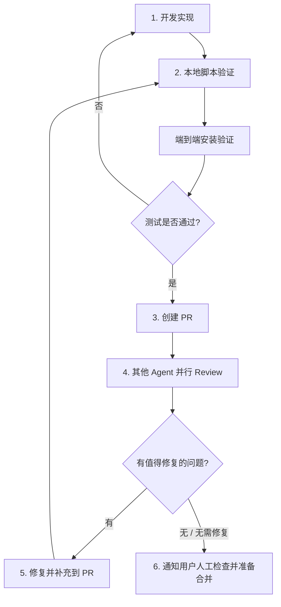

# CLAUDE.md

Claude Code 最佳配置集合 — 以 marketplace 形式分发 skills, hooks, rules, agents。

## 项目结构

本仓库是一个 Claude Code **marketplace**，包含一个或多个 plugin。

```
├── .claude-plugin/
│   └── marketplace.json      — Marketplace 清单
├── plugins/
│   └── work-toolkit/         — 主插件
│       ├── .claude-plugin/
│       │   └── plugin.json   — 插件清单
│       ├── skills/           — 技能定义
│       ├── hooks/            — 钩子脚本
│       ├── commands/         — 斜杠命令
│       ├── agents/           — 子代理定义
│       └── rules/            — 通用规则
├── CLAUDE.md
├── README.md
└── LICENSE
```

## Skills

每个 skill 目录包含：
- `SKILL.md` — 技能主文件，含 YAML frontmatter（至少 `name` 和 `description`）
- `scripts/` — 附带脚本（hook 脚本等）
- `references/` — 参考文档

## 已有 Skills

- **data-analysis** — 数据分析与报告生成，支持 CSV/Excel/数据库协作分析
- **frontend-design** — 创建高质量、生产级前端界面，避免通用 AI 风格
- **skill-creator** — 创建、修改、优化 skills，支持 eval 测试和性能基准分析
- **excalidraw-diagram-generator** — 通过自然语言生成 Excalidraw 图表（流程图、架构图、思维导图等）
- **auto-research** — 面向可量化目标的自动迭代优化。运行前强制要求填写五项 Goal Contract（measurable artifact / verification command / allowed write scope / stop signal / pause condition），缺项就拒跑；主 agent 是监督者，必须核验 stop signal 才能宣告 COMPLETE，迭代上限 / 阻塞 / 资源耗尽报为 PAUSED 而非 COMPLETE。Goal Contract 思路借鉴 OpenAI Codex `/goal` 实践。
- **pragmatic-engineering** — 分级工程纪律，按任务复杂度自动匹配流程深度（L0 直接执行 → L3 子代理编排），避免简单任务被重流程拖慢
- **image-gen** — 通用 AI 图像生成，通过 OpenAI-compatible API 抽象层接入任意端点。支持参考图工作流（给一张或多张参考图保持风格/IP 一致性）、本地文件自动 base64、face 编辑、比例和分辨率控制
- **hf-papers** — 通过 Hugging Face CLI 搜索、浏览和阅读学术论文，支持搜索、每日/趋势论文、论文详情和全文阅读
- **agent-task** — 通过内置 Agent Bridge 将任务委托给外部 CLI 编码 Agent。支持 Codex、OpenCode、QoderCLI，可用于代码评审、对抗式评审、代码解释、通用任务委托和多 Agent 结果对比
- **critic-loop** — 多 Agent 质量循环：N 个 Worker 执行子任务，一个 Critic 评估器按预定 rubric 评审产出；默认使用原生子 Agent，用户指定 Codex、OpenCode 或 QoderCLI 时走 Agent Bridge。适合用标准判断质量的场景（研究、文档、代码设计），而非数字指标场景（用 auto-research）
- **piclist-image-hosting** — 将 Markdown 中的本地图片通过 PicList 上传到用户配置的图床，用在线 URL 替换本地路径。依赖本地运行的 PicList App，无需额外 API key 配置

## 标准开发 / 测试 / PR / Review 流程

对本仓库的 plugin、skill、hook、bridge runtime 做非平凡变更时，按以下闭环执行：



1. **开发实现**
   - 明确变更属于新增 skill、替换/删除公开 skill、hook 变更、文档变更还是 runtime 变更。
   - 涉及公开能力变化时，同步更新 `README.md`、`README_CN.md`、`CLAUDE.md`。
   - 每次发布型变更必须 bump `plugins/work-toolkit/.claude-plugin/plugin.json` 的 `version`。

2. **本地脚本 + 端到端测试**
   - 先运行 `scripts/verify-plugin.sh`。
   - 再运行 `scripts/verify-plugin.sh --e2e`。
   - 脚本必须覆盖 `claude plugin validate .`、`claude plugin validate plugins/work-toolkit`、关键文件存在性、runtime smoke test、hook smoke test、旧引用检查。
   - 端到端验证必须通过临时 local marketplace 执行 `claude plugin install --scope local`，并检查安装缓存中的 skill、hook、runtime 文件，而不是只验证源码目录。
   - 不允许忽略 validator warning；能修就修，不能修必须在结果中说明原因。
   - 变更涉及 `agent-task` / Agent Bridge 时，还要至少跑一次真实 bridge task；如果支持多个外部 CLI，逐个说明哪些真实可用、哪些因本机认证或模型配置失败。

3. **创建 PR**
   - 提交/PR 前查看 `git status --short`，不要把无关 untracked 文件、压缩包、临时文件带入提交。
   - 仅在用户明确要求时创建 commit 或 PR。
   - PR 描述必须包含 Summary 和 Test plan；Test plan 至少列出 `scripts/verify-plugin.sh` 和 `scripts/verify-plugin.sh --e2e` 的结果。

4. **其他 Agent Review**
   - PR 创建后或准备创建 PR 前，对非平凡变更使用 `agent-task` 并行触发 Codex、OpenCode、QoderCLI Review：
     `node plugins/work-toolkit/skills/agent-task/scripts/bridge/bridge.js --task review --scope working-tree --agents codex,opencode,qoder`
   - Review 结果要区分：真实缺陷、文档/示例问题、环境问题、误报。
   - 如果某个外部 CLI 因认证、模型配置或超时失败，要记录为环境问题，不把它等同于代码通过。

5. **修复 / 复测 / 再 Review 循环**
   - 有值得修复的问题：修复并补充到 PR，然后重新运行本地脚本验证和端到端测试。
   - 修复后再次触发必要的 Agent Review。
   - 循环直到无问题，或剩余问题明确无需修复并说明原因。

6. **通知用户人工检查**
   - 自动验证和 Agent Review 都完成后，明确告知用户：可以进行人工 check，准备合并。
   - 不要擅自合并或 push，除非用户明确授权。

## 版本管理

插件版本号在 `plugins/work-toolkit/.claude-plugin/plugin.json` 的 `version` 字段中维护，遵循 [semver](https://semver.org/) 规范：

- **patch**（0.2.0 → 0.2.1）：bug 修复、模板微调、文档修正
- **minor**（0.2.0 → 0.3.0）：新增 skill、现有 skill 功能增强、新增 hook
- **major**（0.x → 1.0）：破坏性变更、大规模重构

**每次发布更新时必须 bump 版本号。** Claude Code 通过版本号判断是否需要更新插件——如果改了代码但没 bump 版本号，用户不会收到更新（缓存机制）。用户可通过 `claude plugin update work-toolkit@cc-best-config` 拉取新版本，再执行 `/reload-plugins` 生效。注意：第三方 marketplace 的 auto-update 默认关闭，用户需在 `/plugin` 管理界面手动开启。

## 文档同步约定

- 新增 skill 后，同时更新 `README.md`、`README_CN.md` 和本文件中的技能清单。
- 如果 skill 的核心行为发生变化，优先在 `SKILL.md` 中写清楚执行约束，再在总览文档里补一句高层说明。
- 对带脚本或外部依赖的 skill，文档至少说明运行方式、关键依赖和基本配置入口。

## Hooks

- **agent-cli-context** — 报告 Codex/OpenCode/QoderCLI 是否安装。注册为 `PreToolUse` + matcher `Skill`，由 `skill-prerun.sh` 调度，**仅在 `agent-task` skill 触发时**通过 `hookSpecificOutput.additionalContext` 注入给模型
- **ensure-hf-cli** — 仅在 `hf-papers` skill 触发时检查并自动安装 `huggingface_hub[cli]`，同样走 `skill-prerun.sh` 调度
- **ensure-python-env** — 仅在 `data-analysis` skill 触发时检查并自动把 pandas/matplotlib/seaborn 装入项目 `.venv`，同样走 `skill-prerun.sh` 调度
- **protect-files** — 阻止修改 .env、密钥、凭证等敏感文件（PreToolUse + matcher `Edit|Write`），始终生效
- **notify-push** — 带任务上下文的推送通知，支持 Bark 等 webhook 推送 + 桌面通知 fallback（Notification + Stop）。设置 `NOTIFY_URL` 环境变量启用移动端推送
- **stop-guard** — 会话结束前检查任务完成度 + 文档是否需要更新（Stop）

> **关于 skill-scoped hook 的设计选择**：早期实现把 skill 级 hook 写在 `SKILL.md` frontmatter 的 `hooks:` 块里，但当前 Claude Code 不会触发这种 hook（[#39468](https://github.com/anthropics/claude-code/issues/39468)）。改为 `PreToolUse` + `matcher: "Skill"` + 调度脚本 `skill-prerun.sh` 后，hook 真正受 skill 名过滤、按 skill 生命周期触发。新增 skill 级 hook 时直接复用 `skill-prerun.sh <skill-suffix> <command...>` 模式即可。

## 安装

```bash
# 1. 添加 marketplace
claude plugin marketplace add zhangtyzzz/cc-best-config

# 2. 安装插件
claude plugin install work-toolkit
```
